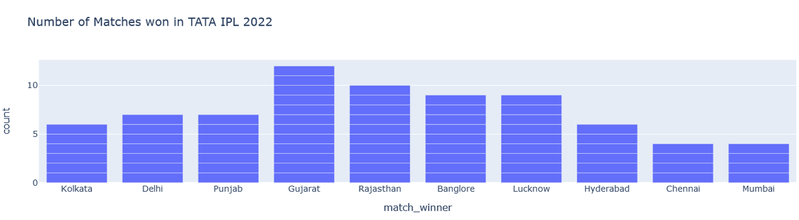
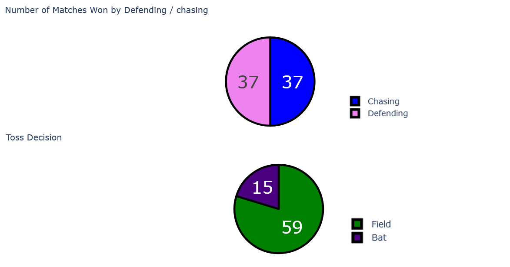
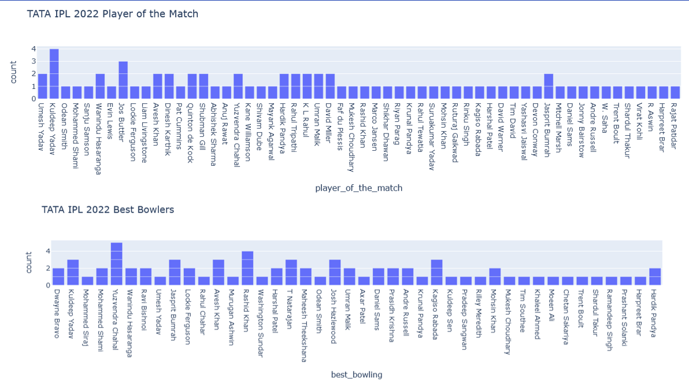
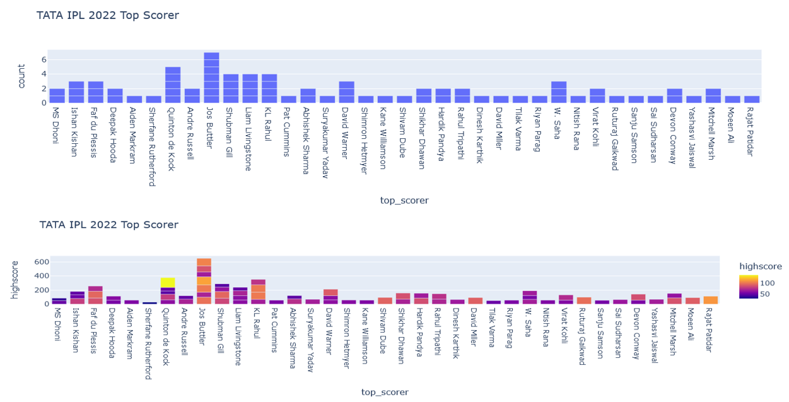

# IPL 2022 Data Visualizer 📊🏏

A Python-based interactive data visualization project that analyzes IPL 2022 match data using Pandas and Plotly.

## 📌 Overview

This project was built as part of the Samsung Innovation Campus Python program. It visualizes real-world IPL 2022 match data to uncover insights about team performance, toss decisions, player contributions, and match outcomes.

## 🚀 Features

- Number of matches won by each team (Bar Chart)
- Toss decision distribution (Pie Chart)
- Match outcome (Chasing vs Defending) (Pie Chart)
- Top scorers and their high scores (Bar Chart)
- Player of the Match frequency (Bar Chart)
- Best bowling figures (Bar Chart)
- Venue-wise scores and wickets (Grouped Bar Charts)

## 🛠 Tech Stack

- Python
- Pandas
- Plotly Express & Graph Objects
- CSV (Data Source)
## ⚠️ Note: The actual IPL 2022 dataset (`IPL2022_Data.csv`) is not included due to source restrictions. You can add your own structured IPL 2022 dataset to run the visualizations.

## 📊 How to Run

1. Clone the repo:
   ```bash
   git clone https://github.com/AswinThApa04/ipl-2022-data-visualizer
   cd IPL-Data-Visualizer
   ```

2. Install dependencies:
   ```bash
   pip install pandas plotly
   ```

3. Run the visualizer:
   ```bash
   python visualizer.py
   ```

## 📈 Sample Visualizations

Below are some key insights derived from the IPL 2022 match data:

### 🏆 Matches Won by Teams


### 🧠 Toss Decision vs Outcome


### 🌟 Top Performers (Player of the Match & Best Bowlers)


### 🔥 Top Scorers and Their High Scores


> ⚠️ Dataset has been excluded from the repository. All insights are visualized and preserved via the screenshots.

